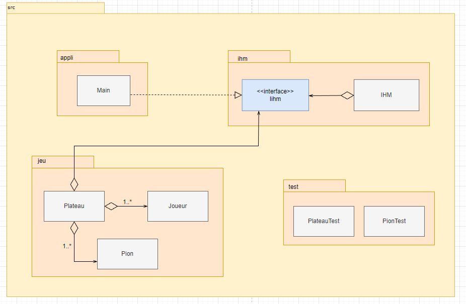

# hex203-204
 Membres de l'équipe : Sofia Hazami, André Domingues Ramos, Babylone Isshak, Eric Ye (203)
 
 MZ: Note 13/20 au groupe. La note de l'exo du DST ne sera prise en compte que si elle est supérieure donc cette note ne peut pas baisser.

Dans ce projet, ce qui a été réussi est : tout ce qui constitue le jeu, c'est-à-dire, son plateau, ses pions, ses joueurs. Ansi que le déroulement du jeu, à savoir: la victoire ou non du joueur.
Ce qui ne fonctionne pas est : le score. Malheureusement nous n'avons pas réussi à implémenter la fonctionnalité de score mais, en revanche, l'ia est fonctionnelle et la fonction de victoire a été implémentée.

Voici notre diagramme d'architecture : 

Nous avons mis en place une IA, si le joueur est seul et souhaite être contre cette dernière ou si un utilisateur veut voir 2 IAs s'affronter. Malheureusement nous n'avons pas eu le temps d'implémenter des règles un peu plus poussée comme celle du joueur 2 qui peut prendre le coup du joueur 1 au premier tour.

Bilan du projet :

Ce que nous pensons avoir réussi sont les fonctions : l'intégration des joueurs, ils peuvent jouer à tour de rôle et choisir leur nom. Vérifier si la partie est gagnée ou non, a aussi été faite, même si au début nous avions des erreurs puisque l'on avait mal configurer le plateau, nous avons corrigé cette erreur. Nous avons aussi pu ajouter une IA avec laquelle on peut faire des parties IA VS IA ou IA VS Joueur.

Tandis que les fonctions qui sont à améliorer sont : Nous pensons que nous pouvons améliorer l'IA car elle choisit ses pions à placer aléatoirement et que ça serait beaucoup plus intéressant de pouvoir sélectionner des niveaux de difficultés chez l'IA pour que les joueurs puissent s'entrainer et relever des défis et, par conséquent, ne pas s'ennuyer pendant la partie. De plus, nous aurions pu grandement améliorer notre projet si nous avions réussi à implémenter la fonction de score et de tournoi.

Enfin, les difficultés rencontrées au cours du projet ont été pour la fonction de victoire. Etant donnée que nous avions perdu notre premier jet de la fonction victoire, nous avons été découragé et avons un peu délaissé le projet. Nous nous sommes donc retrouvés à court de temps. De plus, nous ne sommes par très à l'aise avec la récursivité donc nous avons codé environ 5 ou 6 versions de la fonction hasWon (nous n'avons pas commit à chaque fois car on se rendait compte que ça ne marchait pas avant). Finalement, nous avons réussi à la coder et même si nous avons fini en retard, nous sommes quand même fier d'avoir persévéré même si à plusieus reprises nous avons voulu abandonner le projet et le rendre sans la fonction hasWon.
